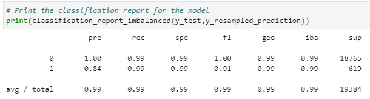

# Challenge12

# Credit Risk Resampling

This is a Jupyter notebook that uses various techniques to train and evaluate models with imbalanced classes. It aims to use a dataset of historical lending activity from a peer-to-peer lending services company to build a model that can identify the creditworthiness of borrowers.

---

## Technologies

This project leverages Python 3.7 with the following packages and dependencies:

* [pandas](https://pandas.pydata.org/) - An open-source data analysis and manipulation tool

* [numpy](https://numpy.org/) - Used for numerical computing tools

* [pathlib](https://docs.python.org/3/library/pathlib.html) - Used to identify a file using absolute or relative path

* [balanced_accuracy_score](https://scikit-learn.org/stable/modules/generated/sklearn.metrics.balanced_accuracy_score.html) - Computes the balanced accuracy

* [confusion_matrix](https://scikit-learn.org/stable/modules/generated/sklearn.metrics.confusion_matrix.html) - Computes confusion matrix to evaluate the accuracy of a classification

* [classification_report_imbalanced](https://imbalanced-learn.org/dev/references/generated/imblearn.metrics.classification_report_imbalanced.html) -  Builds a classification report based on metrics used with imbalanced dataset

---

## Installation Guide

Python 3.7, GitBash, sklearn, and JupyterLab are required to be installed before running the application.

---

## Usage

To run the application simply clone the repository and run the **credit_risk_resampling.ipynb** with:

```python
credit_risk_resampling.ipynb
```

Attached screenshot below shows the classification report result:

  

---

## Contributors

Brought to you by Christine Guo (www.linkedin.com/in/christine-guo)

---

## License

NoNe